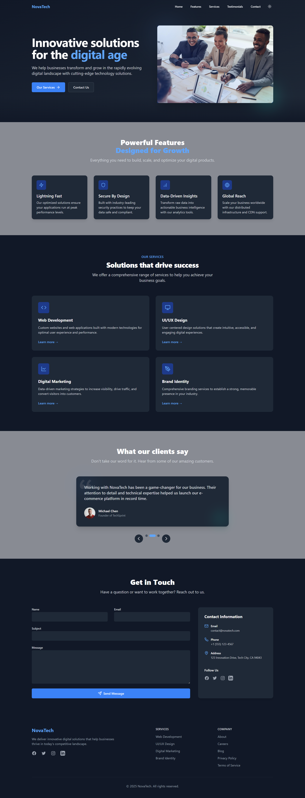

# NovaTech - Modern React Website

A professional, responsive website built with React, TypeScript, and Tailwind CSS. Features a modern design with smooth animations, dark mode support, and optimized performance.



## Features

- 🎨 Modern, responsive design
- 🌓 Dark/light mode with persistent user preference
- ⚡ Performance optimized with code splitting and lazy loading
- 📱 Mobile-first approach
- 🎭 Smooth animations and transitions
- 📝 Contact form with validation
- 🎯 SEO optimized
- ♿ Accessibility compliant

## Tech Stack

- React 18
- TypeScript
- Tailwind CSS
- Vite
- Lucide Icons

## Getting Started

1. Clone the repository:
```bash
git clone https://github.com/Abu-Hojayfa/novatech.git
cd novatech
```

2. Install dependencies:
```bash
npm install
```

3. Start the development server:
```bash
npm run dev
```

4. Open [http://localhost:5173](http://localhost:5173) in your browser

## Build for Production

```bash
npm run build
```

## Design Credits

This design is inspired by modern SaaS and tech company websites, with a focus on clean aesthetics and user experience. The layout and components are custom-built to showcase professional services and company information effectively.

## License

MIT License - feel free to use this template for your projects!